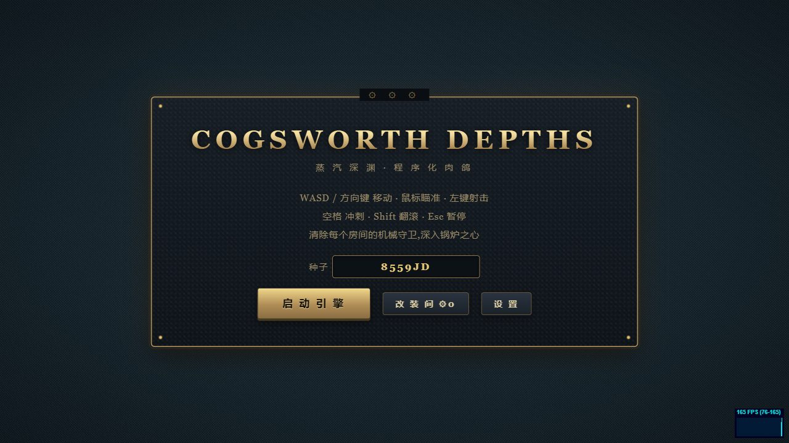
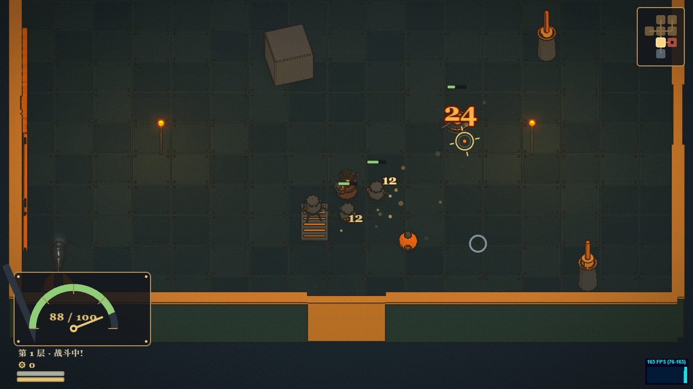
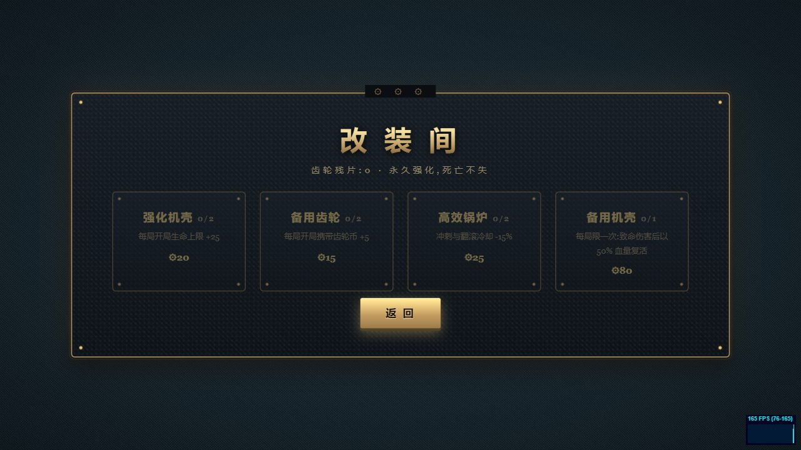
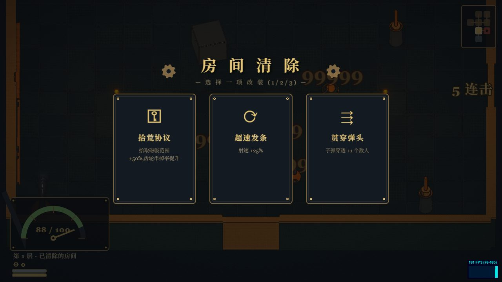
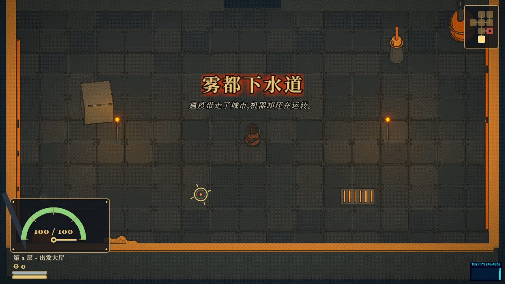
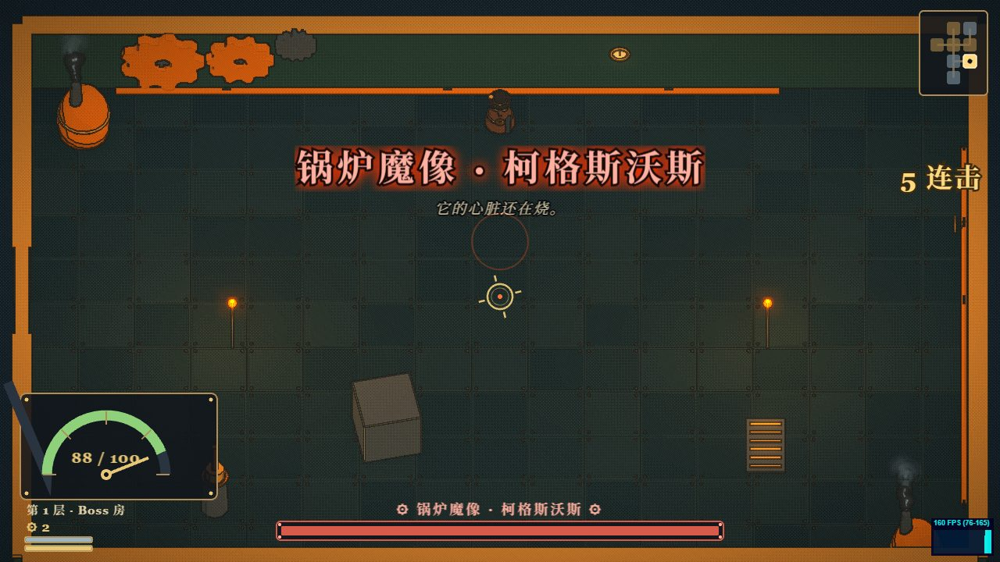
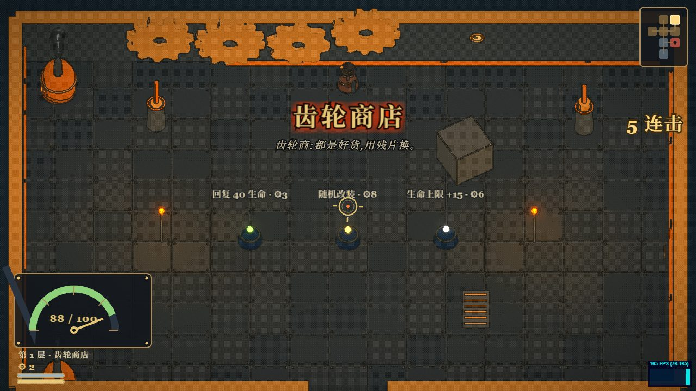
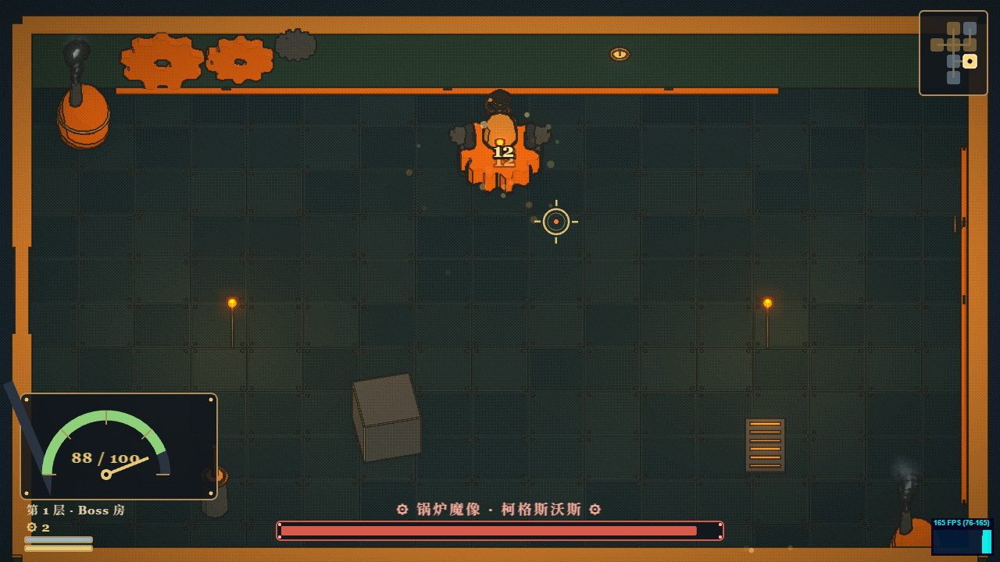

# Cogsworth Depths

[中文 README](./README.md)

A **zero-asset, fully procedural** Victorian plague-doctor roguelite for the browser.
Not a single image or audio file ships with this project — models, textures, VFX, music, SFX and even the story text are all generated by code at runtime.

## ▶ Play Online

**[https://kingsystemhaigo.github.io/cogsworth-depths/](https://kingsystemhaigo.github.io/cogsworth-depths/)**

The build is a single self-contained HTML file (`docs/index.html`, ~1.2MB) — you can also download it and double-click to play offline.

## Screenshots

| Title & Workshop | Combat & Upgrades |
| --- | --- |
|  |  |
|  |  |

| Story & Shop | Boss fights |
| --- | --- |
|  |  |
|  |  |

## Controls

| Key | Action |
| --- | --- |
| WASD / Arrows | Move |
| Mouse | Aim (pointer-lock virtual crosshair) |
| LMB | Fire |
| Space | Dash (pure mobility, no i-frames) |
| Shift | Roll (full i-frames, pure defense) |
| 1 / 2 / 3 | Quick-pick upgrade cards |
| Esc | Pause / Resume |
| F1 | Dev console |

## Game loop

Clear each room's clockwork guards (wave-based encounters with spawn telegraphs) → pick 1 of 3 stackable upgrades (with level badges) → detour to treasure rooms & cog shops → boss (enrages at 50% HP) → next floor. Floors are seed-generated and reproducible. Settings include 中文/EN language and independent music/SFX volume.

## Features

- **Wave-based encounters**: telegraph rings (≥0.55s) before enemies pop in; 2 waves from floor 2, 3 from floor 4, staged boss intros
- **10 steampunk automatons**: wind-up spiders, sentry turrets, walking boilers, pounce fleas, splitters, shield wardens, mortars, clockwork snipers, tinker drones, and 2 bosses (Boiler Golem / Ringmaster Margot)
- **13 stackable upgrades**: splitter valve, pierce, ricochet, burst rounds, steam aegis, gear familiar… with level badges — and the player's form mutates as you stack them (extra barrels / taller smokestack / shield bubble)
- **Meta progression**: earn gear scrap every run and buy permanent upgrades in the Workshop (Hades-style Mirror of Night), persisted in localStorage
- **Story & dialogue**: per-floor names and plague-doctor log banners, intro lines for both bosses, full 中文/EN localization
- **Hazards & side rooms**: periodic steam jets, treasure rooms, cog shops, three room themes (iron / rust / verdigris)

---

## Tech stack & architecture

### Dual-engine layered rendering

```
┌ PixiJS canvas (transparent): HUD / damage numbers / particles / upgrade UI / crosshair
├ Three.js canvas: 3D scene / characters / bullets (main render)
└ DOM: title / pause / settings / game-over
```

Game logic runs on a flat 2D plane (XZ); 3D is pure presentation. The engines are bridged by
`Vector3.project(camera)` world→screen: damage numbers, enemy HP bars and price tags all "stick" to 3D objects.

### Procedural modeling (zero assets)

- **Gears**: `THREE.Shape` tooth profile → `ExtrudeGeometry`, meshed pairs counter-rotating
- **Boilers**: `LatheGeometry` + emissive firebox + steam vents (custom GLSL `ShaderMaterial`; even the sprite texture is canvas-generated)
- **Pipes**: `CatmullRomCurve3` + `TubeGeometry` along random polylines with flanges and valves
- **Floor texture**: canvas-drawn iron plates, rivets and seams — no image files
- **Characters**: plague-doctor doll (top hat / beak mask / goggles / leather coat) assembled from primitives, and its **form mutates with upgrades** (extra barrels / taller smokestack / shield bubble)

### Custom comic render pipeline (NPR)

Chain: `RenderPass → cel pass → Bloom → final grade`

1. **Cel shading**: `MeshToonMaterial` + 3-step gradient map
2. **Silhouette outlines**: back-face hull expansion
3. **Fresnel rim light**: injected via `onBeforeCompile`
4. **Sobel ink lines**: post-process edge detection
5. **Bayer dithering**: brightness bands rendered as copper-plate halftone dots
6. **Pixelation**: block sampling aligned to physical pixels (DPR 1.5)
7. **Split-tone grading**: teal shadows / warm brass highlights

### Procedural audio

- **SFX synth**: oscillators + noise buffers + filter envelopes for shots, explosions, metal clanks and steam; a WaveShaper drive + compressor on the master bus glues everything into one "dirty" tone
- **Music engine**: tracker-style lookahead scheduler (40ms tick, 0.15s ahead), 112 BPM D-minor 8-bar loop — square bass, arpeggios, synthesized kick/snare/hats

### Game systems

- **Wave encounters**: telegraph rings (≥0.55s) before enemies pop in; 2 waves from floor 2, 3 from floor 4, 0.9s breather between waves
- **8 enemy types**: chaser / turret / bomber / pounce-flea / splitter / shield warden (frontal block) / mortar / boss (phase 2: spiral barrage + summons)
- **11 stackable upgrades** with caps and level badges; cog economy + treasure & shop rooms
- **Balance sheet**: every number lives in `src/game/balance.ts`, with polynomial difficulty curves (HP `1+0.22f+0.05f²`, boss `950+420×floor`)

---

## Performance & game-feel engineering (highlights)

### Fixed substep simulation

At low frame rates, large `dt` makes bullets tunnel through enemies and ties gunplay to FPS.
The simulation slices every frame into ≤1/90s substeps (up to 6): **hit detection stays exact at 10fps**
and game feel is fully decoupled from frame rate — the single most important engineering decision in this project.

### Dynamic resolution scaling (DRS)

Three quality tiers (1.5x / 1.0x / 0.75x render scale). FPS EMA < 42 for 2.5s → step down, > 56 for 8s → step up.
**Quality-first rule: tiers only change resolution — bloom, outlines, halftone and pixelation stay on at every tier.**

### Zero hot-path allocation

Aiming, projection and ballistic code reuse pre-allocated temp vectors — no GC hitches.

### The orthographic camera aiming trap

`screenToGround` must NOT use `unprojectedPoint − camera.position` as the ray direction —
that only holds for the center pixel and collapses off-center ground points toward the middle
(it once caused "the gun ignores the crosshair"). Correct approach: ray direction equals the camera forward;
unproject is only used to fetch the per-pixel ray origin.

### Pointer-lock virtual crosshair

Aiming uses `unadjustedMovement` raw input (bypasses OS pointer acceleration),
`mousemove` listened at document level (some browsers stop element-level `pointermove` under lock),
and the Pixi crosshair tracks the clamped virtual cursor 1:1 with zero latency.

### Other details

- Squash & stretch on hits, spin-out death bursts, kill shockwave rings
- Walk cycle driven by **stride phase** (synced to displacement, not wall time)
- Scene decoration occupancy registry (`claim()`) so procedural props never intersect
- Magnetized cog pickups; spawn telegraphs ≥500ms (informed by Hades telegraph-window research)

## Development

```bash
npm install
npm run dev      # dev server with HMR
npm run build    # builds docs/ (GitHub Pages) + dist/ (local double-click)
```
